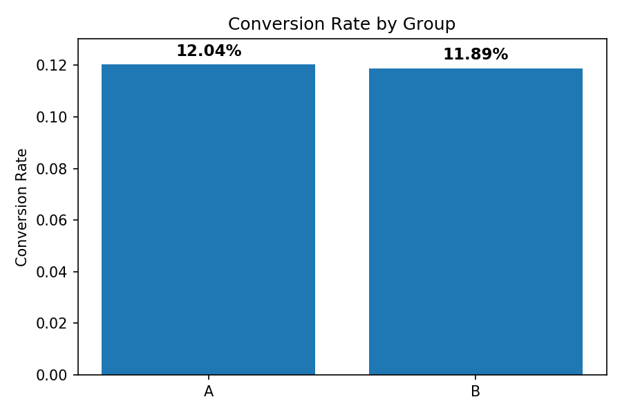

# AB_Testing_Ecommerce_Analysis

 Ecommerce_AB_Testing_Project  

*Business Analyst / ICT Portfolio Case Study (2024–2025)*  
Simulated an A/B test on ~294k user sessions to evaluate whether a redesigned landing page (Variant B) outperformed the existing design (Variant A).  

Result: *Variant B did not outperform Variant A*. Conversion was nearly identical (A = 12.04%, B = 11.89%), with both Z-test (p=0.893) and Chi-Square (p=0.216) confirming no statistical significance.  

---

## 📌 Project Overview
- *Objective:* Evaluate a landing page redesign using controlled A/B testing.  
- *Dataset:* ~294k sessions, balanced 50/50 across groups.  
- *Methodology:* Data validation, cleaning/deduplication, hypothesis framing, Z-test, Chi-Square, funnel diagnostics, and dashboarding.  
- *Role Demonstrated:* Business Analyst / ICT professional aligning *statistics → insights → business storytelling*.  

---

## 📊 Key Findings
- *Conversion Rates:* A = *12.04%, B = **11.89%* (gap = -0.15pp).  
- *Statistical Tests:* No evidence B is better (Z-test p=0.893, Chi-Square p=0.216).  
- *Funnel Analysis:* Nearly identical performance; redesign added no uplift.  
- *Business Decision:* *Keep Variant A*; Variant B adds cost/risk without ROI.  

---

## 📈 Visuals & Dashboards  

*Conversion Rate by Group*  
  

*Conversion Rate by Landing Page*  
  

*Funnel Analysis by Group*  
  

*Executive Dashboard Mock (Power BI style)*  
  

---

## 🛠 Tools & Skills
- *Python (pandas, scipy, matplotlib)* – data cleaning & statistical testing  
- *SQL & Excel* – validation and aggregation  
- *Power BI Mockups* – stakeholder-friendly dashboards  
- *BA/ICT Practices* – requirements framing, hypothesis design, governance (Jira/Confluence)  

---

## 📂 Repository Structure

ab-testing-ecommerce-analysis/
├── data/          # Raw dataset (~294k rows)
├── notebook/      # Jupyter analysis with stats & funnel diagnostics
├── images/        # Visuals: conversion, funnel, dashboard mock
├── Report/          # Portfolio report & 1-page executive summary
└── README.md
